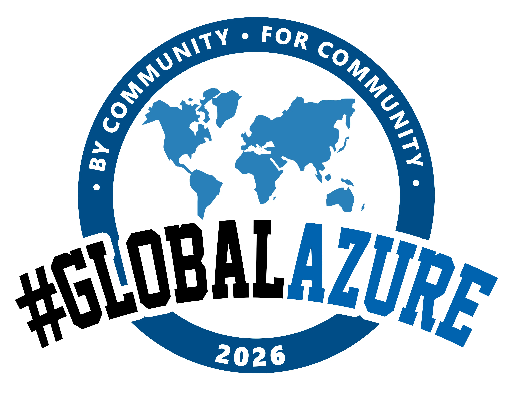

# Global Azure 2026 - Presentation Materials



## Welcome! 👋

Thank you for attending my Global Azure 2026 session! This repository contains all the presentation materials and resources shared during the session.

## 📋 Repository Contents

- **Presentation Slides** - The complete slide deck from the session
- **Code Samples** - All demo code and examples shown during the presentation
- **Resources** - Links and references mentioned in the talk

## 🎯 Session Overview

*[Add your session title and description here]*

### Key Topics Covered

- *[Topic 1]*
- *[Topic 2]*
- *[Topic 3]*

## 🚀 Getting Started

### Prerequisites

*[List any prerequisites needed to run the demos or samples]*

### Running the Demos

*[Add instructions for running any code samples or demos]*

```bash
# Example commands
git clone https://github.com/matthewjlevy/GlobalAzure.git
cd GlobalAzure
```

## 📚 Additional Resources

- [Global Azure Official Website](https://globalazure.net/)
- [Microsoft Azure Documentation](https://docs.microsoft.com/azure)
- *[Add any other relevant resources]*

## 💬 Feedback & Questions

Feel free to:
- Open an [issue](https://github.com/matthewjlevy/GlobalAzure/issues) if you have questions
- Connect with me on [LinkedIn](https://linkedin.com/in/your-profile) *(update with your profile)*
- Follow me on [Twitter/X](https://twitter.com/your-handle) *(update with your handle)*

## 📄 License

*[Add license information if applicable]*

---

**Global Azure 2026** | Presented by Matthew J Levy
